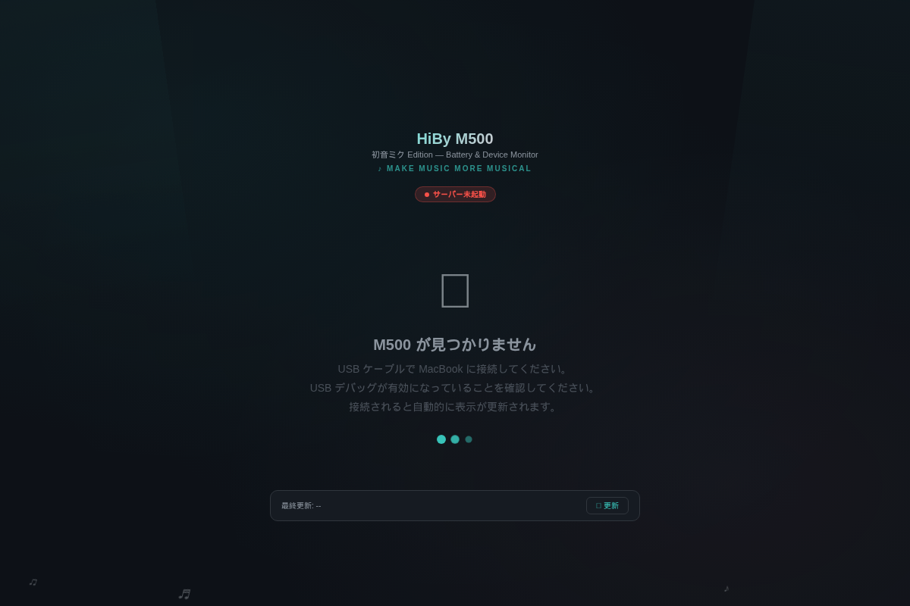

# HiBy M500 Monitor - Miku Edition

[](https://github.com/kakignu/M500_MIKU/actions/workflows/build-and-release.yml)

macOS メニューバーに常駐する HiBy M500 バッテリーモニターアプリです。
ミクカラーのダッシュボードで、バッテリー状態をリッチに表示します。

<p align="center">
  
</p>

## ダウンロード

👉 **[最新版をダウンロード（macOS）](https://github.com/kakignu/M500_MIKU/releases/latest/download/HiBy_M500_Monitor.zip)**

> リリースがまだない場合は [Actions のビルド成果物](https://github.com/kakignu/M500_MIKU/actions/workflows/build-and-release.yml) からダウンロードできます。
> 最新の成功したビルドを開き、ページ下部の **Artifacts** セクションから `HiBy-M500-Monitor-macOS` をダウンロードしてください。

## スクリーンショット

<p align="center">
  
</p>

## 機能

- メニューバーからバッテリー情報をすばやく確認
- WKWebView ベースのミクカラーダッシュボード
- USB 接続を検出し自動で WiFi ADB に切り替え
- ケーブルを外しても監視を継続

## 必要条件

- macOS 12.0+
- Python 3.9+
- adb (`brew install android-platform-tools`)
- HiBy M500 の USB デバッグが有効であること

## セットアップ（ソースから実行する場合）

```bash
# 依存関係のインストール
./setup.sh

# 起動
./run.sh
```

## .app ビルド

```bash
./build_app.sh
```

ビルド後、`HiBy M500 Monitor.app` をダブルクリックで起動できます。

## GitHub Actions

`main` ブランチへの Push で自動ビルドが実行されます。
`v*` タグを Push すると GitHub Releases に .zip が自動アップロードされます。

```bash
git tag v1.0.0
git push origin v1.0.0
```
